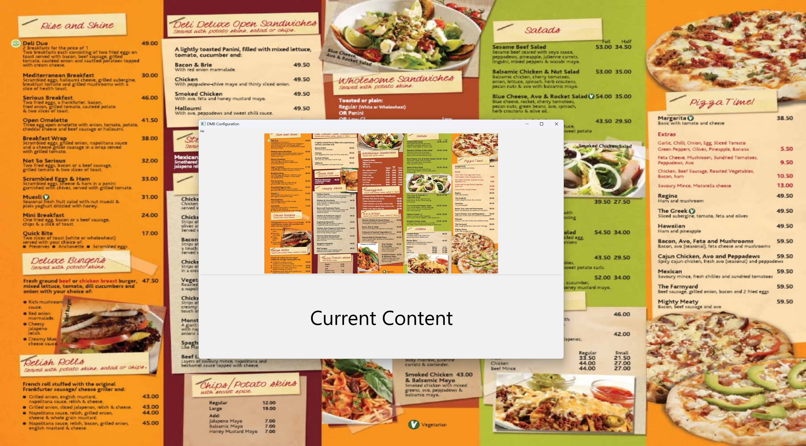
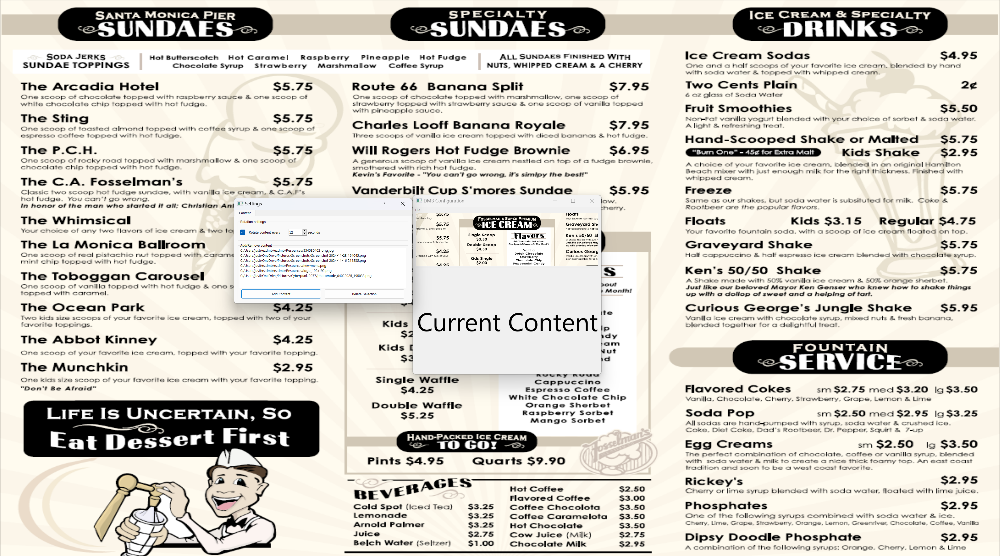

# ezdmb
A dead-simple digital menu board display and configuration, written in Python.  Engineered to be the simplest, cheapest, fastest way to get your menu to display on **any** tablet or computer.  Ridiculously user friendly, with basic configuration interface.

## How to run through python3 (dev mode)
1. Run the environment install script in a bash terminal: `chmod +x ./setup-dev-environment.sh && ./setup-dev-environment.sh`
2. Run the app: `python3 -m ezdmb`

## Basic Operation
- On load, both the fullscreen and configuration windows are loaded.  The configuration window can be simply closed by the user if it is not needed, leaving the fullscreen "menu board display" window open.
- The 'Esc' key on the keyboard can be used to exit the application.

## Configuration
File > Edit Display Settings in the DMB Configuration window allows access to 

### Advanced install instructions / troubleshooting install

If the developer install script/procedure does not work for you, try installing manually as follows:

1. Install python libraries: `pip install -r requirements.txt`
2. Install pyqt dev tools: `sudo apt install pyqt5-dev-tools`
3. Install the qt framework loader: `pip install -U pip && pip install aqtinstall`
4. Use the qt framework loader to install v5.15.2: `aqt install-qt linux desktop 5.9.0`
5. Add qt build tools to your path (replace `<username>` in the command with the username on the system): `export PATH="/home/<username>/ezdmb/5.15.2/gcc_64/bin":$PATH`

On Windows and Mac, use the Qt Framework install packages provided at https://www.qt.io/

## Roadmap
- Load on startup option in win + linux installers
- Multi monitor options
- Import and render menu data from json, yml file
